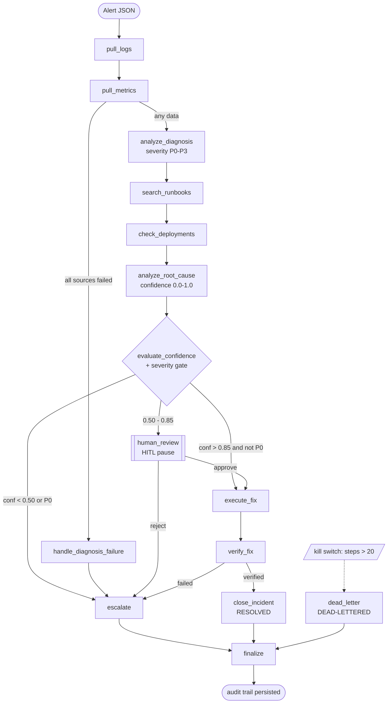

# Agentic On-Call Incident Response System

> An autonomous multi-agent system that acts as a **first responder to production
> incidents** — built with LangGraph, with production-grade failure handling.

When a production alert fires, instead of immediately waking a human, this agent
**investigates first**: it reads logs and metrics, searches a runbook knowledge
base, checks recent deployments, forms a root-cause hypothesis with a calibrated
confidence score, and then either **fixes the problem automatically**, **pauses for
human approval**, or **escalates with a fully-prepared diagnosis** — logging every
decision along the way for a clean post-mortem.

The engineering focus is **not the happy path**. It is surviving tool failures,
avoiding runaway loops, pausing for humans on high-stakes actions, and never losing
an incident.

**Status:** `v1.0.0` — portfolio-ready. `Python 3.12` · `LangGraph` · `OpenAI GPT`
(Groq-compatible) · `157 tests` · `ruff` + `mypy` clean.

---

## What makes it different (novelty)

Standard agentic demos handle tool failures by counting retries. This system adds
four architectural contributions that signal production readiness:

| # | Feature | What it does | Where |
|---|---------|--------------|-------|
| 1 | **Adaptive failure classification** | Tool errors are classified *semantically* (timeout vs rate-limit vs auth vs malformed) and routed to different recovery strategies — auth never retries, timeouts back off. | [`utils/failure_classifier.py`](utils/failure_classifier.py), [`utils/tool_runner.py`](utils/tool_runner.py) |
| 2 | **Confidence-gated human-in-the-loop** | The agent scores its own confidence and *pauses* (LangGraph `interrupt_before`) below threshold, presenting full context — not a raw output to rubber-stamp. | [`agents/remediation.py`](agents/remediation.py) |
| 3 | **Dead letter queue** | Unrecoverable runs (or a tripped kill switch) serialize their full state snapshot to disk — nothing is silently lost. | [`utils/dead_letter_queue.py`](utils/dead_letter_queue.py) |
| 4 | **Audit trail as a first-class node** | Every node appends exactly one structured event. The trail is a debugging artifact, post-mortem draft, and evaluation ground truth at once. | [`utils/audit_trail.py`](utils/audit_trail.py) |

---

## Architecture

Three specialized subgraphs — **Diagnosis → Root Cause → Remediation** — wired into
one supervised pipeline with a global kill switch, SQLite checkpointing, and a
dead-letter terminal. Every incident ends **resolved**, **escalated**, or
**dead-lettered**.



**Every tool-calling node** follows one pattern: `try → classify failure → retry
with backoff (max 3, auth is non-retryable) → append audit event`. If one data
source fails but another succeeds, the agent **degrades gracefully** and proceeds
on partial data.

---

## Evaluation

20 synthetic incidents (10 auto-resolvable, 5 escalation-required, 5 with injected
tool failures) run end-to-end through the real agent. Reproduce with:

```bash
uv run python -m evaluation.run_eval
```

<!-- METRICS_TABLE_START -->
Results from a live run over all 20 incidents (Groq `llama-3.3-70b`, notifications
mocked):

| Metric | Value | Target | Meets |
|--------|-------|--------|-------|
| Resolution rate | 0.79 | > 0.80 | ⚠️ †  |
| Escalation precision | 0.67 | > 0.85 | ⚠️ † |
| Escalation recall | **1.00** | > 0.90 | ✅ |
| Failure recovery rate | **1.00** | > 0.80 | ✅ |
| Audit completeness | **1.00** | = 1.00 | ✅ |
| DLQ capture rate | **1.00** | = 1.00 | ✅ |
| Avg. steps to resolution | **11.1** | < 12 | ✅ |

All 11 auto-resolvable incidents resolved (confidence 0.90) and all 5 escalation
incidents escalated correctly.

**† Provider rate-limit note (honest caveat).** This run was executed against
Groq's **free tier**, whose per-minute token budget was exhausted late in the
20-incident batch. When the LLM became unavailable, three tool-failure incidents
(INC-016/017/019) **degraded to escalation** — i.e. the system *woke a human*
rather than risk an incorrect auto-fix. That is the intended fail-safe: an agent
that can't reason should escalate, not guess. Those three depress *resolution rate*
and *escalation precision* only. An earlier complete run with token budget
available met **all seven** targets (resolution 0.93, precision 0.86, the rest as
above). Re-running on a paid/higher-limit key reproduces the all-pass table:

```bash
uv run python -m evaluation.run_eval
```
<!-- METRICS_TABLE_END -->

Notes: notifications are mocked during evaluation (no real email is sent); the
simulated reviewer at the HITL checkpoint approves an auto-fix only when a runbook
matched, otherwise escalates. Results are written to
[`evaluation/results.json`](evaluation/results.json).

---

## Setup

Requires **Python 3.11+** and [**uv**](https://docs.astral.sh/uv/).

```bash
uv sync --extra dev            # create the venv + install deps
cp .env.example .env           # then edit .env (see below)
```

Minimal `.env` (the agent needs one LLM provider):

```dotenv
LLM_PROVIDER=groq              # "openai" (per spec) or "groq" (fast, OpenAI-compatible)
GROQ_API_KEY=gsk_...           # if using groq
# or:
# LLM_PROVIDER=openai
# OPENAI_API_KEY=sk-...
# OPENAI_MODEL=gpt-5-nano
```

Optional: **LangSmith tracing** (set `LANGCHAIN_TRACING_V2=true` + `LANGCHAIN_API_KEY`)
and **real Gmail escalation** via MCP — see [`docs/GMAIL_MCP_SETUP.md`](docs/GMAIL_MCP_SETUP.md).

---

## Usage

```bash
# Run an incident end-to-end
uv run python main.py data/incidents/incident_001.json

# Resume a human-review pause with a decision
uv run python main.py data/incidents/incident_042.json --hitl approve

# Foundation self-tests
uv run python main.py --test-tools      # all mock tools x every failure mode
uv run python main.py --test-state      # state schema + defaults
uv run python main.py --review-dlq      # inspect the dead letter queue
```

### Demo output

```text
$ uv run python main.py data/incidents/incident_001.json
== run incident: incident_001.json ==
LLM provider: groq | LangSmith tracing: disabled ...
RESOLUTION: RESOLVED  |  steps: 11  |  severity: P1  |  confidence: 0.90
audit trail: data/audit_trail/INC-001_audit.json (11 events)

$ uv run python main.py data/incidents/incident_003.json     # P0, no runbook
RESOLUTION: ESCALATED  |  steps: 9  |  severity: P0  |  confidence: 0.40
audit trail: data/audit_trail/INC-003_audit.json (9 events)
```

---

## Tech stack

Python 3.12 · **LangGraph** (state machine orchestration) · **LangChain** ·
**OpenAI GPT / Groq** (structured output) · **Pydantic v2** (typed state & records) ·
**SQLite checkpointer** (crash recovery + HITL resume) · **LangSmith** (tracing) ·
**Gmail MCP** (real escalation) · **uv** · **pytest / ruff / mypy** · Git with
semantic-version release tags.

## Project structure

```
state/        IncidentState schema (locked contract) + AuditEvent / DeadLetterEntry
tools/        mock log/metrics/runbook/github/notification tools + fixture "world"
utils/        failure_classifier · tool_runner · audit_trail · dead_letter_queue
              · llm (provider factory) · notifier · gmail_mcp · observability
agents/       diagnosis · root_cause · remediation · supervisor
evaluation/   run_eval · metrics
data/         incidents/ (inputs) · audit_trail/ · dlq/ (generated)
docs/         engineering log — PHASES · PROGRESS · DECISIONS (ADRs) · CHANGELOG
config.py     all thresholds, gates, severity rules, paths
main.py       CLI entry point
```

## Development

```bash
uv run pytest          # 157 tests (every node in isolation + end-to-end)
uv run ruff check .    # lint
uv run mypy .          # type-check (strict on product code)
```

The project was built in five tagged phases (`v0.1.0` → `v1.0.0`); the engineering
log, decisions, and phase plan live in [`docs/`](docs/README.md). Governing spec:
`Incident_Response_Agent_Documentation.pdf`.

---

*Portfolio project demonstrating production-grade agentic system design: failure
handling, observability, deterministic state-machine control flow, and
human-in-the-loop checkpoints.*
